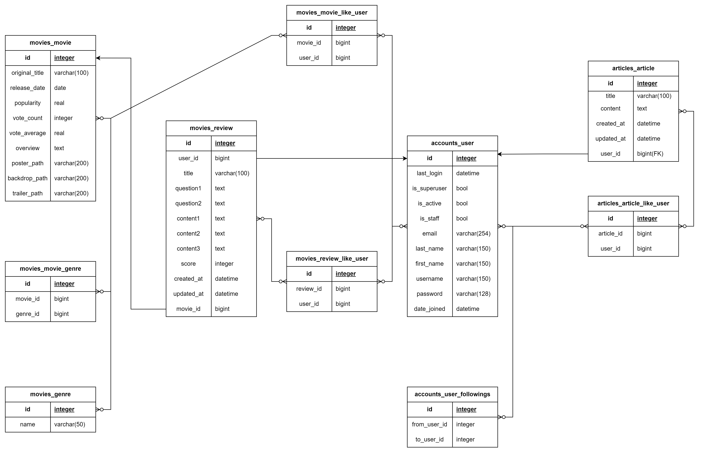
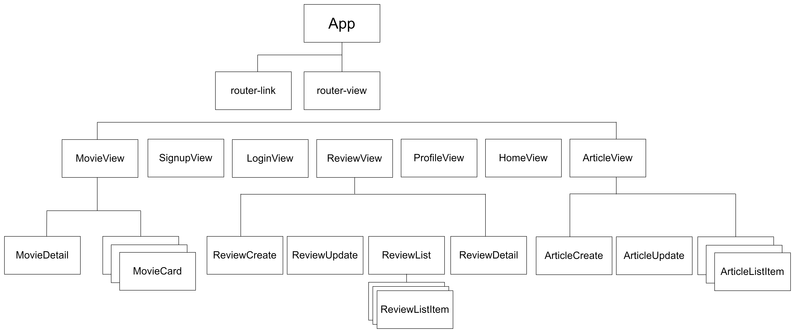

## i. 팀원 정보 및 업무 분담 내역
+ ### 안민
1. front-end
2. review, movie 페이지 driver / article, profile  페이지 navigator
3. 부트스트랩을 활용하여 페이지 레이아웃 구성 및 꾸미기.

+ ### 위효선
1. back-end
2. article, profile 페이지 driver / review, movie 페이지 navigator
3. django를 활용하여 데이터를 다룹니다.

## ii. 목표 서비스 구현 및 실제 구현 정도
+ ### 의도한 서비스
1. 장르별로 영화 구분하여 이용자가 장르 선택해 영화 리스트 볼 수 있도록 한다.
2. 리뷰 작성 시 랜덤으로 질문을 출력하여 이용자가 답하도록 한다.
3. 실천기 작성 시 사진을 첨부할 수 있도록 한다.
4. 이용자들 간 좋아요, 팔로우 눌러 커뮤니티의 원활한 이용을 도모한다.
5. 영화 디테일에 유튜브 영상을 삽입하여 이용자의 영화 선택을 돕는다.

+ ### 실제 구현 정도
1. 8개의 장르로 구분하여 이용자가 선택할 수 있게 했다.
2. 9개의 질문 중 2개의 질문이 랜덤으로 출력되어 이용자가 답한다.
3. 사진을 첨부하는 기능은 구현하지 못했다.
4. 좋아요, 팔로우 기능 구현 성공. 영화 찜 기능까지 구현했다.
5. 유튜브 영상 삽입 성공

> 기존 의도와 1개 제외 일치

## iii. 데이터베이스 모델링 (ERD)

## iv. 영화 추천 알고리즘에 대한 기술적 설명
장르별로 구분된 json 파일을 이용. filter 함수를 통해, 장르가 일치하는 movie를 출력할 수 있도록 구현했습니다.

## v. 서비스 대표 기능에 대한 설명
+ 평소 영화 리뷰를 작성할 때마다 흰 종이에 리뷰를 적어내는 것이 어렵다 느꼈습니다. 하지만, 친구가 영화에 대한 질문을 제시해주면 감상을 생각하는 것이 어렵지 않았습니다. 이에 영화를 보고 보편적으로 생각할 수 있는 지점들에 대한 질문을 리스트업하고 이를 랜덤으로 제시하는 기능을 제공하였습니다.(lodash sample사용)
+ 찜 기능. 좋아요와 똑같이 구성하였습니다.

## vi. 배포 서버 URL (배포했을 경우)
배포하지 않음.

## vii. 기타 (느낀 점, 후기 등)
+ ### 안민
그 동안 이해하기보다는 이렇게 한다는 방법을 외워서 과제나 실습을 진행했었다. 하지만, 직접 의도한 바를 구현하려 하다보니 코드의 이유와 로직을 완전히 이해할 수 있게 되었다. 내가 의도한 대로 페이지가 나올지 언정 console창에 오류가 많았는데, 그 이유는 코드의 실행 순서에 있었다. watch를 사용하여 순서를 설정하는 방식을 이론 상으로만 알았는데, 프로젝트를 통해 확실히 알게 되었다. 

+ ### 위효선
페어 프로그래밍을 진행하며 진정한 의미의 협업이 무엇인지, 효과적으로 분업을 하는 것이 얼마나 중요한지 실감할 수 있었습니다. 동료와 함께 힘을 모아 프로젝트를 진행한 덕분에 맡은 일을 성공적으로 완수할 수 있었다고 생각합니다. 1학기를 관통하는 프로젝트를 진행하며, 제가 배운 것들을 되새기고 보다 심도 있게 익힐 수 있었습니다. 다가오는 계절학기와 잡페어 기간을 십분 활용하여 2학기를 준비하겠습니다. 앞으로 프로젝트를 진행하며 항상 지금을 잊지 않도록 노력하겠습니다. 감사합니다!!

+ ### 공통
1. serializer의 쓰임을 데이터 직렬화로만 알고 있었습니다. 하지만, serializer fields를 잘 활용한다면 백엔드 로직이 매우 효과적으로 구현될 수 있다는 사실을 알게 되었습니다. 사소한 배움이었지만, 신세계였습니다. 프로젝트의 막힌 혈을 뚫어주었죠.
2. 에러 발생 시, 대처하는 방식에 대해 배웠습니다. 이전에는 에러 메시지를 잘 읽지 않아서 오류가 어디서 발생한 것인지 파악하는 데 상당한 어려움을 겪었습니다. 하지만, console을 잘 확인하여보니 에러의 힌트가 있었습니다. 앞으로 이를 잊지 않고 오류 발생 시 오류를 뜯어 고쳐보겠습니다.
